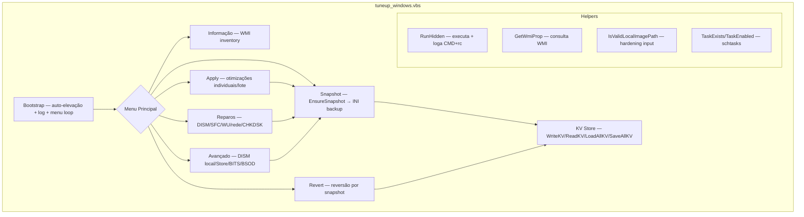

<div align="center">

# Windows Tune-Up Script

[](https://github.com/ESousa97/windows-tuneup-script/actions/workflows/ci.yml)
[](https://www.codefactor.io/repository/github/esousa97/windows-tuneup-script)
[](https://opensource.org/licenses/MIT)
[](#)

**Utilitário VBScript interativo para manutenção, reparo e otimização reversível do Windows — menu principal com 22 opções (otimizações individuais, aplicar/reverter tudo), submenu de reparos com 11 opções (DISM, SFC, reset Windows Update com 35 DLLs, reset de rede, CHKDSK), submenu avançado com 7 opções (DISM com fonte local hardened, Microsoft Store, BITS, BSOD report), sistema de snapshot/rollback reversível via INI key-value para serviços, tasks, registro e plano de energia, inventário WMI (SO, CPU, RAM, tipo de disco), auto-elevação administrativa, logging de todas as operações, paths configuráveis via variáveis de ambiente, testes PowerShell (lint estrutural + smoke tests), CI em windows-latest com build de ZIP distribuível e Security Audit semanal com secret-pattern scan.**

</div>

---

> **⚠️ Projeto Arquivado**
> Este projeto não recebe mais atualizações ou correções. O código permanece disponível como referência e pode ser utilizado livremente sob a licença MIT. Fique à vontade para fazer fork caso deseje continuar o desenvolvimento.

> **⚠️ Disclaimer:** Este script modifica configurações do sistema operacional. Crie um ponto de restauração e faça backup antes de executar. Use por sua conta e risco.

---

## Índice

- [Sobre o Projeto](#sobre-o-projeto)
- [Demonstração](#demonstração)
- [Funcionalidades](#funcionalidades)
- [Tecnologias](#tecnologias)
- [Arquitetura](#arquitetura)
- [Estrutura do Projeto](#estrutura-do-projeto)
- [Começando](#começando)
  - [Pré-requisitos](#pré-requisitos)
  - [Instalação](#instalação)
  - [Uso](#uso)
- [Scripts Disponíveis](#scripts-disponíveis)
- [Menus Completos](#menus-completos)
- [Testes](#testes)
- [Qualidade e Segurança](#qualidade-e-segurança)
- [FAQ](#faq)
- [Licença](#licença)
- [Contato](#contato)

---

## Sobre o Projeto

Utilitário interativo em VBScript para executar operações comuns de manutenção e recuperação do Windows com logging de auditoria e snapshots de configuração reversíveis. Projetado para usuários avançados e operadores que precisam de uma ferramenta local rápida para DISM, SFC, tuning de serviços, limpeza e rollback.

O repositório prioriza:

- **Sistema de snapshot/rollback reversível** — `EnsureSnapshot()` persiste o estado atual de serviços (`wuauserv`, `WSearch`, `SysMain`), tasks agendadas (Compatibility Appraiser, ProgramDataUpdater, StartupAppTask), registro (VisualEffects, MinAnimate, AeroPeek) e plano de energia ativo em `TuneUp_Backup.ini` via formato INI key-value. Toda operação mutante chama `EnsureSnapshot()` antes de executar. `RestoreAll()` reverte todos os itens ao estado original
- **7 módulos internos no VBScript** — Bootstrap (auto-elevação via `Shell.Application.ShellExecute "runas"`, log init, menu loop), Informação (WMI: SO, CPU, RAM, tipo de disco via `Win32_DiskDrive.RotationRate`), Snapshot (backup de serviços/tasks/registro/power plan), Apply/Revert (otimizações individuais e em lote), Reparos (DISM/SFC/Windows Update/rede/CHKDSK), Avançado (DISM com fonte local, Store, BITS, BSOD), Helpers (RunHidden com logging, WMI, file I/O, KV store)
- **Hardening do DISM com fonte local** — `IsValidLocalImagePath()` valida input rejeitando aspas, `&`, `|`, `>`, `<` (prevenção de command injection), verifica extensão `.wim`/`.esd` e existência do arquivo antes de construir o argumento DISM
- **Reset completo do Windows Update** — Para `wuauserv`, `bits`, `cryptsvc`, renomeia `SoftwareDistribution` e `catroot2` com timestamp, reinicia serviços, re-registra 35 DLLs do Windows Update via `regsvr32 /s`
- **Logging de todas as operações** — Cada `RunHidden(cmd, wait)` registra `CMD: {comando} (rc={código})` em `TuneUp_Log.txt`. Path configurável via `TUNEUP_LOG_PATH`
- **Testes PowerShell** — Lint estrutural (`Option Explicit`, ausência de tabs/merge markers, 6 símbolos obrigatórios), smoke tests (5 assertions: menu com saída, snapshot sob demanda, reversão completa, validação DISM, logging de comandos), build (ZIP distribuível com 8 arquivos obrigatórios), secret-pattern scan (4 padrões regex em 6 extensões)
- **CI em windows-latest** — Lint → Test → Build → Upload artifact `windows-tuneup-dist.zip`, Security Audit semanal com secret-pattern scan

---

## Demonstração

```text
========================================
 Tune-Up | Principal
========================================

 INFORMACOES
  1) Mostrar informacoes do sistema

 APLICAR (nao reversiveis: 2, 9, 10)
  2) Limpar temporarios
  3) Desabilitar Compatibility Appraiser
  4) Desabilitar Windows Update (wuauserv)
  5) Desabilitar Windows Search (WSearch)
  6) Desabilitar SysMain/Superfetch
  7) Ativar plano Alto Desempenho
  8) Otimizar Efeitos Visuais (melhor desempenho)
  9) Limpeza profunda de disco (Cleanmgr)
 10) Otimizar/Desfragmentar C:
 98) Aplicar TUDO

 REVERTER (onde aplicavel)
203-208) Reverter individualmente
 99) Reverter TUDO possivel

 SUBMENUS
300) Reparos do Windows
400) Avancado

  0) Sair
```

---

## Funcionalidades

### Menu Principal (22 opções)

- **Informações do sistema** — Inventário WMI: SO (Caption+Version), CPU (Name), RAM (TotalPhysicalMemory), tipo de disco (NVMe/SSD/HDD via RotationRate)
- **Limpar temporários** — Remove arquivos de `%TEMP%` e `C:\Windows\Temp` (não reversível)
- **Desabilitar serviços** — Windows Update (`wuauserv`), Windows Search (`WSearch`), SysMain/Superfetch — via WMI `StopService` + `ChangeStartMode("Disabled")` + `sc` fallback
- **Desabilitar Compatibility Appraiser** — 3 tasks agendadas desabilitadas: `Microsoft Compatibility Appraiser`, `ProgramDataUpdater`, `StartupAppTask`
- **Plano de energia** — Ativa Alto Desempenho/Ultimate via `powercfg -SETACTIVE`
- **Efeitos visuais** — 4 chaves de registro: `VisualFXSetting=2`, `MinAnimate=0`, `EnableAeroPeek=0` + `UpdatePerUserSystemParameters`
- **Limpeza profunda** — Prepara 26 categorias do Cleanmgr com `StateFlags0001=2` e executa `cleanmgr.exe /sagerun:1`
- **Desfragmentação** — `defrag C: /O` (não reversível)
- **Aplicar TUDO** (opção 98) — Executa todas as otimizações em sequência
- **Reverter** (203-208, 99) — Restaura serviços, tasks, registro e plano de energia ao estado do snapshot

### Submenu Reparos (11 opções, código 300)

- DISM: `/CheckHealth`, `/ScanHealth`, `/RestoreHealth`, `/StartComponentCleanup /ResetBase`
- SFC `/scannow`
- Reset do Windows Update (para serviços, renomeia pastas, reinicia, re-registra 35 DLLs)
- Reset de rede (Winsock, IP, flush DNS)
- CHKDSK: `/scan` (online) e `/F /R` (agendado no boot)
- Aplicar TODOS os reparos (opção 398)

### Submenu Avançado (7 opções, código 400)

- DISM com fonte local (`.wim`/`.esd` + Index) com validação hardened
- Restaurar Microsoft Store via `Add-AppxPackage`
- Listar/limpar fila BITS
- Relatório de BSOD (últimos 5 via `Get-WinEvent`)
- Abrir pasta de Minidumps
- Reiniciar

---

## Tecnologias


---

## Arquitetura



### Módulos Internos

| Módulo | Responsabilidade |
| --- | --- |
| **Bootstrap** | Auto-elevação via `Shell.Application.ShellExecute "runas"`, abertura de log, loop principal do menu |
| **Informação** | `ShowInfo()` — WMI: `Win32_OperatingSystem`, `Win32_Processor`, `Win32_ComputerSystem`, `Win32_DiskDrive` |
| **Snapshot** | `EnsureSnapshot()` → `SnapshotState()` — persiste 3 serviços, 3 tasks, 4 chaves de registro, 1 GUID de power plan em INI |
| **Apply/Revert** | 9 operações de otimização + 6 de reversão + `RestoreAll()` para rollback completo |
| **Reparos** | 10 operações: DISM (3), SFC, ComponentCleanup, ResetWindowsUpdate (35 DLLs), ReregisterUpdateDLLs, ResetNetworkStack, CHKDSK (2) |
| **Avançado** | 7 operações: DISM com fonte local (hardened), Store, BITS (list/clear), BSOD report, Minidumps, restart |
| **Helpers** | `RunHidden()` com logging, `GetWmiProp()`, `IsValidLocalImagePath()`, `TaskExists/Enabled()`, KV store (INI) |

### Decisões de Design

| Decisão | Justificativa |
| --- | --- |
| Single-file VBScript | Execução simples para end users, sem dependências de packaging |
| Snapshot antes de mutações | Estado anterior persistido para rollback seguro |
| Logging de cada comando | Rastreabilidade para suporte e auditoria |
| Paths via variáveis de ambiente | Políticas corporativas sem edição de código |
| Hardening de input no DISM local | Rejeita `& \| > < "` para prevenir command injection |

---

## Estrutura do Projeto

```
windows-tuneup-script/
├── tuneup_windows.vbs                          # Script principal — 7 módulos, 40+ operações
├── scripts/
│   ├── lint.ps1                                # Lint: Option Explicit, tabs, merge markers, 6 símbolos obrigatórios
│   ├── test.ps1                                # Smoke tests: 5 assertions estruturais
│   ├── build.ps1                               # Build: ZIP com 8 arquivos em dist/
│   ├── security-audit.ps1                      # Secret scan: 4 padrões regex em 6 extensões
│   └── validate.ps1                            # Pipeline: lint + test + build + security
├── docs/
│   ├── architecture.md                         # Módulos, decisões, data flow, constraints
│   ├── deployment.md                           # Distribuição, release flow, requisitos
│   └── setup.md                                # Execução, env overrides, quality checks
├── .github/
│   ├── workflows/
│   │   ├── ci.yml                              # Lint + Test + Build + Upload artifact (windows-latest)
│   │   └── security.yml                        # Secret-pattern scan semanal (segunda 08:00 UTC)
│   ├── ISSUE_TEMPLATE/
│   │   ├── bug_report.yml                      # Com dropdown versão Windows + aviso archived
│   │   ├── feature_request.yml                 # Com dropdown breaking change
│   │   └── config.yml                          # Blank issues disabled
│   ├── PULL_REQUEST_TEMPLATE.md
│   ├── CODEOWNERS                              # @ESousa97 (com paths granulares)
│   ├── FUNDING.yml
│   └── dependabot.yml                          # GitHub Actions (PRs desabilitados)
├── .editorconfig                               # UTF-8, LF, indent 2
├── .gitattributes                              # LF normalizado, CRLF para .bat/.cmd
├── .gitignore                                  # TuneUp_Log.txt, TuneUp_Backup.ini, dist/, *.bak
├── .env.example                                # TUNEUP_LOG_PATH, TUNEUP_BACKUP_PATH
├── CHANGELOG.md                                # Keep a Changelog (v1.0.0 → v1.1.0 → v1.1.1)
├── CONTRIBUTING.md                             # Conventional Commits + validação local
├── CODE_OF_CONDUCT.md                          # Contributor Covenant 2.1
├── SECURITY.md                                 # Política de disclosure + baseline
└── LICENSE                                     # MIT + Disclaimer PT-BR/EN
```

---

## Começando

### Pré-requisitos

- Windows 10 ou Windows 11 (best effort para 7/8/8.1)
- Execução como **Administrador**
- PowerShell 7+ (para scripts de qualidade locais)

### Instalação

```powershell
git clone https://github.com/ESousa97/windows-tuneup-script.git
cd windows-tuneup-script

# Validar repositório
pwsh ./scripts/validate.ps1
```

### Uso

```powershell
cscript //nologo tuneup_windows.vbs
```

O script solicita elevação automaticamente se não executado como Administrador.

**Paths opcionais:**

```powershell
$env:TUNEUP_LOG_PATH = 'C:\Temp\TuneUp_Log.txt'
$env:TUNEUP_BACKUP_PATH = 'C:\Temp\TuneUp_Backup.ini'
cscript //nologo tuneup_windows.vbs
```

---

## Scripts Disponíveis

```powershell
# Lint estrutural (Option Explicit, tabs, merge markers, símbolos)
pwsh ./scripts/lint.ps1

# Smoke tests (5 assertions)
pwsh ./scripts/test.ps1

# Build (ZIP distribuível em dist/)
pwsh ./scripts/build.ps1

# Secret-pattern scan (4 padrões × 6 extensões)
pwsh ./scripts/security-audit.ps1

# Pipeline completa (lint + test + build + security)
pwsh ./scripts/validate.ps1
```

---

## Menus Completos

<details>
<summary><strong>Menu Principal (22 opções)</strong></summary>

| Código | Operação | Reversível |
| --- | --- | --- |
| 1 | Informações do sistema (WMI) | — |
| 2 | Limpar temporários | Não |
| 3 | Desabilitar Compatibility Appraiser (3 tasks) | Sim (203) |
| 4 | Desabilitar Windows Update (wuauserv) | Sim (204) |
| 5 | Desabilitar Windows Search (WSearch) | Sim (205) |
| 6 | Desabilitar SysMain/Superfetch | Sim (206) |
| 7 | Plano Alto Desempenho/Ultimate | Sim (207) |
| 8 | Otimizar Efeitos Visuais | Sim (208) |
| 9 | Limpeza profunda Cleanmgr (26 categorias) | Não |
| 10 | Desfragmentar/Otimizar C: | Não |
| 98 | Aplicar TUDO | Parcial |
| 203-208 | Reverter individual | — |
| 99 | Reverter TUDO possível | — |
| 300 | Submenu: Reparos | — |
| 400 | Submenu: Avançado | — |
| 0 | Sair | — |

</details>

<details>
<summary><strong>Submenu Reparos (11 opções)</strong></summary>

| Código | Operação |
| --- | --- |
| 301 | DISM /CheckHealth |
| 302 | DISM /ScanHealth |
| 303 | DISM /RestoreHealth |
| 304 | SFC /scannow |
| 305 | Limpeza de componentes (ResetBase) |
| 306 | Reset do Windows Update (3 serviços + 2 pastas + 35 DLLs) |
| 307 | Re-registrar DLLs do Windows Update |
| 308 | Reset de rede (Winsock + IP + DNS) |
| 309 | CHKDSK /scan (online) |
| 310 | CHKDSK /F /R (agendado no boot) |
| 398 | Aplicar TODOS os reparos |

</details>

<details>
<summary><strong>Submenu Avançado (7 opções)</strong></summary>

| Código | Operação |
| --- | --- |
| 401 | DISM /RestoreHealth com fonte local (.wim/.esd + Index) |
| 402 | Restaurar Microsoft Store (Add-AppxPackage) |
| 403 | Listar fila BITS (Get-BitsTransfer) |
| 404 | Limpar fila BITS |
| 405 | Relatório BSOD (últimos 5 eventos WER) |
| 406 | Abrir pasta Minidumps |
| 407 | Reiniciar agora |

</details>

---

## Testes

```powershell
pwsh ./scripts/test.ps1
```

**5 smoke tests** em `test.ps1`:

| Teste | Validação |
| --- | --- |
| Menu com opção de saída | Regex `"\s*0\)\s*Sair"` presente no .vbs |
| Snapshot sob demanda | `If Not fso.FileExists(bakPath) Then SnapshotState` encontrado |
| Reversão completa | `Sub RestoreAll()` definida |
| Validação DISM com fonte local | `IsValidLocalImagePath` referenciada |
| Logging de comandos | `Call LogLine("CMD: " & cmd` presente |

**Lint** (`lint.ps1`): `Option Explicit` obrigatório, ausência de tabs e merge markers, 6 símbolos obrigatórios (`MenuText()`, `ShowRepairMenu()`, `ShowAdvancedMenu()`, `EnsureSnapshot()`, `RestoreAll()`, `RunDISMWithSource()`)

---

## Qualidade e Segurança

- **CI** — GitHub Actions em `windows-latest`: Lint → Test → Build (`dist/windows-tuneup-script.zip` com 8 arquivos) → Upload artifact
- **Security Audit** — Workflow semanal (segunda 08:00 UTC) com `security-audit.ps1` — 4 padrões regex (`api_key`, `secret`, `token`, `password`) em 6 extensões (`.vbs`, `.md`, `.yml`, `.yaml`, `.ps1`, `.txt`)
- **Dependabot** — GitHub Actions (PRs desabilitados — projeto archived)
- **Governança** — Issue templates YAML com dropdown de versão Windows + aviso de archived, PR template com checklist, CODEOWNERS granular (`.github/`, `tuneup_windows.vbs`), FUNDING.yml, CODE_OF_CONDUCT.md, SECURITY.md com baseline

---

## FAQ

<details>
<summary><strong>O que é reversível e o que não é?</strong></summary>

Operações de serviço (3-6), plano de energia (7) e efeitos visuais (8) são reversíveis via snapshot. Limpeza de temporários (2), Cleanmgr (9) e desfragmentação (10) são **não reversíveis** — o menu indica isso explicitamente com `(nao reversiveis: 2, 9, 10)`.
</details>

<details>
<summary><strong>Como funciona o snapshot/rollback?</strong></summary>

Na primeira operação mutante, `EnsureSnapshot()` cria `TuneUp_Backup.ini` com o estado atual: `StartMode` e `State` de 3 serviços, `Enabled` de 3 tasks, valores de 4 chaves de registro e GUID do plano de energia ativo. `RestoreAll()` lê cada chave e reverte ao valor original. O arquivo INI usa formato `chave=valor` e é atualizado incrementalmente.
</details>

<details>
<summary><strong>Por que VBScript e não PowerShell puro?</strong></summary>

VBScript via Windows Script Host (WSH) é nativo em qualquer Windows sem dependências adicionais. O script pode ser executado por duplo-clique ou via `cscript`, com auto-elevação via `Shell.Application`. PowerShell é usado como auxiliar para operações avançadas (BITS, Store, BSOD report) que são mais robustas em PowerShell.
</details>

<details>
<summary><strong>O DISM com fonte local é seguro contra command injection?</strong></summary>

Sim. `IsValidLocalImagePath()` rejeita aspas, `&`, `|`, `>`, `<` no path, valida extensão `.wim`/`.esd` e verifica existência do arquivo via `fso.FileExists()` antes de construir o argumento DISM. O Index é validado como numérico ≥1 e convertido via `CLng()`.
</details>

---

## Licença

Este projeto está sob a licença MIT. Veja o arquivo [LICENSE](LICENSE) para mais detalhes.

```
MIT License - você pode usar, copiar, modificar e distribuir este código.
USE AT YOUR OWN RISK — este script modifica configurações do sistema operacional.
```

---

## Contato

**José Enoque Costa de Sousa**

[](https://www.linkedin.com/in/enoque-sousa-bb89aa168/)
[](https://github.com/ESousa97)
[](https://enoquesousa.vercel.app)

---

<div align="center">

**[⬆ Voltar ao topo](#windows-tune-up-script)**

Feito com ❤️ por [José Enoque](https://github.com/ESousa97)

**Status do Projeto:** Archived — Sem novas atualizações

</div>
